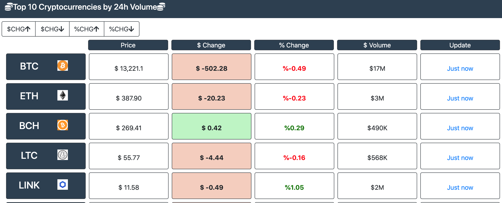
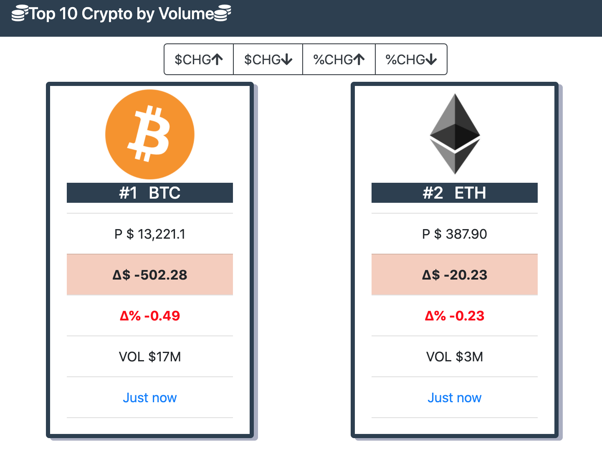

# Top 10 Crypto

This is the first project I built in React. As part of the learning project, this is built using older React methods (class based components and stateless functional components). For a more updated view of my skillset, check out my Cloud Resume (https://github.com/erhallow/cloud-resume) project built in React using hooks and more updated methods. I created this project using Create-React-App.

# Goal of Application

The goal of this application is to manipulate data from an API. It calls the CryptoCompare API (https://min-api.cryptocompare.com/) and displays the data in a table view (desktop) or a card view (mobile). The data it displays is the Top 10 coins by 24 hour trading volume. The data can be sorted by ascending / descending by the dollar / percentage gain. 

# Examples

## Table View

## Card View

